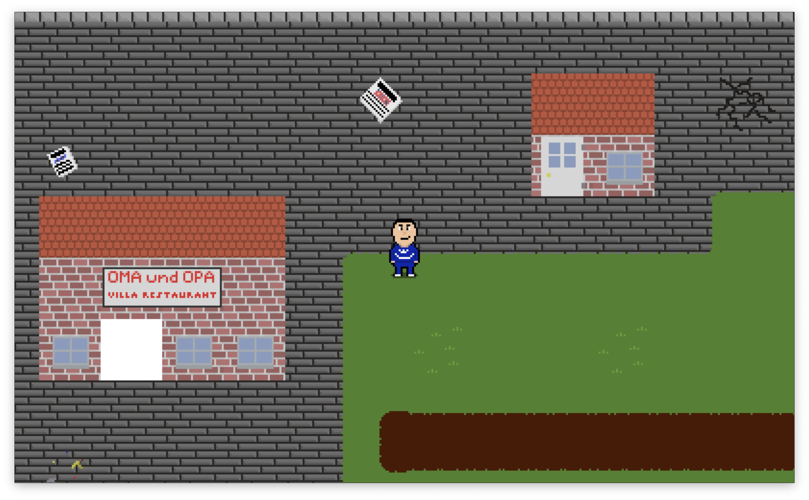
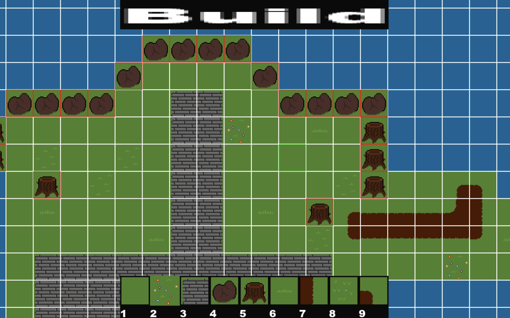

# MarvinGame
A 2D-Topdown game with Pixel graphics, written in C using [SDL2](https://www.google.com/url?sa=t&source=web&rct=j&opi=89978449&url=https://www.libsdl.org/&ved=2ahUKEwjytPvIxYqGAxU9X_EDHRvfBC4QFnoECBAQAQ&usg=AOvVaw0UKX-Hd5cnZaTK_nk7m-ZI). In the game, you play as me in a simplified version of the world I experience day to day. In the game, the main mission is to find the Döner recipe.
This project is my first ever C project, and I learned a lot. I made a lot of mistakes, the biggest one is how header files are used, which I won't change as it is already too late for that.

## Current State
### Game


- You can move the player through a level
- The player has a sprite and walking animations for 4 directions
- The camera scrolls with the player
- The player can collide with objects (e.g. the fence in the picture)
- You can talk to NPCs (In the picture the player talks to Tom)
- All pixel art (except one tile) was created by me

### Walk Animation


### Level Editor


- Level editor for building levels up to 1000x1000 Tiles in size
- You can place Tiles and give them collision
- You can set the player spawn point
- You can place NPCs
- The code for the editor is a mess

## What is planned
- Add more Pixel Art
- Add more NPCs
- Add sound
- Add Quest system
- Add Menu
- Add functionality to save game
- Clean up code (maybe)


## How to run (On Mac and Linux)
If you want to run this very unfinished game or the level editor, you need to install SDL2, SDL2\_ttf and SDL2\_image. On Mac you can use homebrew:

### Install Dependencies on Mac
```
brew install sdl2 sdl2_ttf sdl2_image
```

### Install Source files
```
git clone https://github.com/MarvinDetzkeit/MarvinGame
```
### Compile
```
cd MarvinGame
make
```
### Run the Game
```
./MarvinGame
```
### Run the editor
```
./MarvinEditor
```
