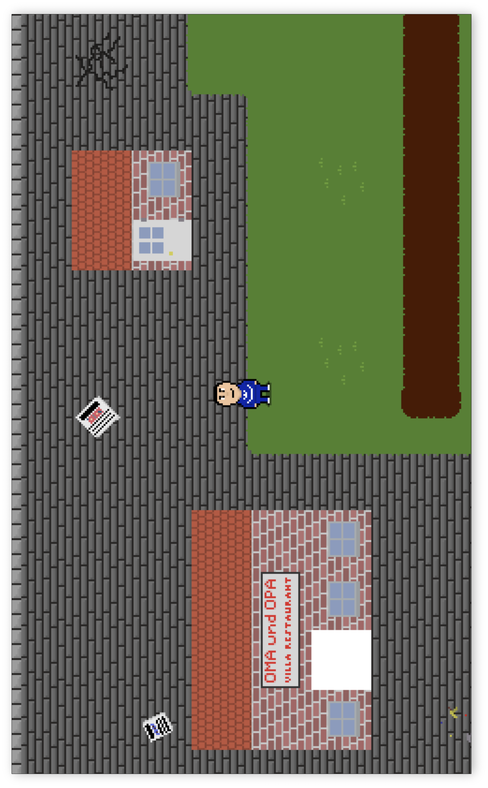

# MarvinGame
A 2D-Topdown game with Pixel graphics, written in C using [SDL2](https://www.google.com/url?sa=t&source=web&rct=j&opi=89978449&url=https://www.libsdl.org/&ved=2ahUKEwjytPvIxYqGAxU9X_EDHRvfBC4QFnoECBAQAQ&usg=AOvVaw0UKX-Hd5cnZaTK_nk7m-ZI).



## How to run
You need to install SDL2, SDL2\_ttf, SDL2\_image and SDL2\_mixer and add the headers to your _CPATH_.

### Install Dependencies on Mac
```
brew install sdl2 sdl2_ttf sdl2_image sdl2_mixer
```

### Install Source files
```
git clone https://github.com/MarvinDetzkeit/MarvinGame
```

### Correct Game Speed
The game logic doesn't use delta time and is tied to 60 fps. To have the game run at the correct speed, change the constant
`VSYNC_WAIT_FRAMES` in line 16 of `src/main.c` to your monitor's refresh rate divided by 60 (use integer). If your monitor's
refresh rate isn't a multiple of 60, use the nearest multiple of 60.

| Refresh Rate | VSYNC\_WAIT\_FRAMES |
|---|---|
| 60 | 1|
| 120 | 2|
| 180 | 3 |
| ... | ...|

### Compile
```
cd MarvinGame
make
```
### Run the Game
```
./MarvinGame
```
### Run the editor
```
./MarvinEditor
```

## Credits
The game theme is [this song](https://www.youtube.com/watch?v=kCd83Zfcmto&list=PLjVTojiDW0-5PCkO2LO-L0RBHtEFu-HmD&index=3) by [Loeder](https://x.com/LoederMusic).

All except one sound effect are from the game [The Legend of Zelda: A Link to the Past](https://en.wikipedia.org/wiki/The_Legend_of_Zelda:_A_Link_to_the_Past).