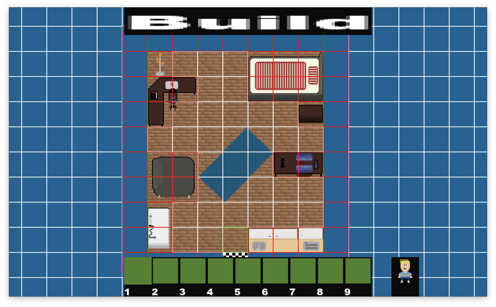

# MarvinGame
A 2D-Topdown game with Pixel graphics, written in C using [SDL2](https://www.google.com/url?sa=t&source=web&rct=j&opi=89978449&url=https://www.libsdl.org/&ved=2ahUKEwjytPvIxYqGAxU9X_EDHRvfBC4QFnoECBAQAQ&usg=AOvVaw0UKX-Hd5cnZaTK_nk7m-ZI). The name is not final, will change when I figure out what the game will become.

## Current State
### Game


- You can move the player (currently a red cube) through a level
- The camera scrolls with the player
- The player can collide with objects (e.g. the rocks below the player in the picture)
- Most Pixel Art was created by me

### Level Editor


- Level editor for building levels up to 1000x1000 Tiles in size
- The code for the editor is a mess

## What is planned
- Add more Pixel Art (Tiles and Characters)
- Add NPCs
- Add a dialogue system
- Add an animation system
- Add sound
- Figure out gameplay
- Clean up code (maybe)

## How to run (On Mac and Linux)
If you want to run this very unfinished game or the level editor, you need to install SDL2, SDL2\_ttf and SDL2\_image. If you're on Mac you can use homebrew.

```
brew install sdl2 sdl2_ttf sdl2_image
```
Clone this repository and change into the directory.

```
git clone https://github.com/MarvinDetzkeit/MarvinGame
cd MarvinGame
```
If you have an Apple Silicon Mac, you can just run the executables and skip compiling. You can use Make for compiling.

Compile the game

```
make build
```
Run the game

```
./MyGame
```
Compile the editor

```
make editor
```
Run the editor

```
./MyEditor
```
